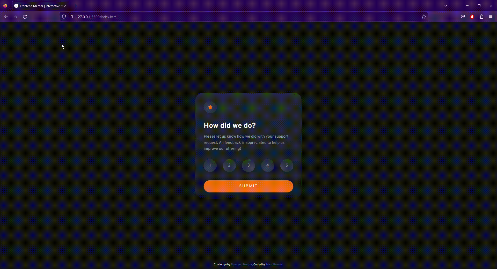

# Frontend Mentor - Interactive Rating Component Solution

This project, the "Interactive Rating Component," was created as a frontend practice exercise to enhance my skills in HTML, CSS, and JavaScript. 
The idea behind this project came from a challenge provided by Frontend Mentor, a platform that offers design challenges to improve frontend development skills. 
Through this challenge, I aimed to build a visually engaging and user-friendly rating component that allows users to provide feedback on a service.

## Table of Contents

- [Overview](#overview)
    - [Preview](#preview)
    - [Links](#links)
    - [The Challenge](#the-challenge)
- [Process](#process)
    - [Description](#description)
    - [Key Features](#key-features)
- [Special Thanks To](#special-thanks-to)
- [License](#license)

## Overview

### Preview

### Links

- **Solution URL**: https://www.frontendmentor.io/solutions/html-css-javascript-92wn59Hk0E
- **Live Site URL**: https://maorbezalel.github.io/interactive-rating-component/

### The Challenge

Users should be able to:

- View the optimal layout for the app depending on their device's screen size
- See hover states for all interactive elements on the page
- Select and submit a number rating
- See the "Thank you" card state after submitting a rating

## Process

### Description

The "Interactive Rating Component" is a simple frontend project that enables users to rate a service on a scale of 1 to 5. 
The project consists of two main sections: the "Rating" state and the "Thank You" state. 
In the "Rating" state, users can click on the rating points to select their desired rating, and the chosen rating is visually highlighted. 
After clicking the "Submit" button, the component transitions to the "Thank You" state, displaying the selected rating and expressing gratitude to the user.

**The project was developed using semantic HTML5 for the structure, CSS for styling and layout, and JavaScript for interactivity.**

### Key Features

- **Interactive Rating**: Users can click on the rating points to select their desired rating from 1 to 5.
- **Visual Feedback**: The selected rating point is highlighted with an orange background and white text.
- **Responsive Design**: The rating component is designed to adapt to different screen sizes, making it mobile-friendly.
- **Thank You Message**: After submitting a rating, users are presented with a "Thank You" message that displays their chosen rating.

## Special Thanks To

- **Frontend Mentor**: For providing the challenge, alongside the necessary images, and style guide. 
You can find their website [here](https://www.frontendmentor.io/). 
- **Ali Shirani**: For creating a detailed video tutorial on the project, which was a valuable resource and greatly assisted me with the CSS part of the implementation. 
His helpful video can be found [here](https://www.youtube.com/watch?v=Nw4y8cAU70w&ab_channel=CodewithAli).

## License

This project is licensed under the MIT License - see the [LICENSE](LICENSE) file for details.

